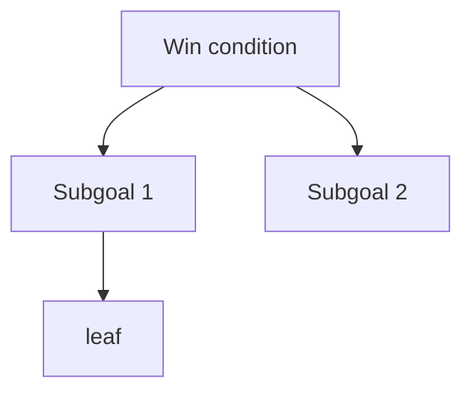

# Plan

## Win condition

<!-- One line. What has to be true for this submission to be good?
Not "finish the task" - the actual outcome the task is a proxy for.
Everything below exists to make this line true. -->

**Win the hackathon.** (his words, 2026-09-12)

**Thesis (one sentence for a judge):** Same city, same model, same seed. Four mayors that differ only in how they close the loop. Watch which city grows.

## Decisions log (2026-09-12, ~13:30, after strategist run 1)
- 2.5 human mayor: DEFERRED to Sun 10:30, only if ahead. No leaderboard, no server. "Play it yourself" mode on the replay page if at all.
- 2.4 embodied world: SHRUNK to a sprite swap from the derived economy tier (cars/horses, shops open/shuttered, sky tint). Click-to-talk NPCs CUT.
- Bureaucrat consultants: TWO, each voicing a bloc, fixed opposite biases, built to contradict.
- Four mayors stay the plan. Two-mayor (Caesar vs Reformer) is a Sunday-morning fallback only.
- Build order: Caesar + Reformer first (the poles; the falsification moment lives between them), then Bureaucrat + Populist as configs.
- ARIA and TypeSafe: OUT. Weave, marimo, social clip: IN.
- Tickets live here + git. Linear not used.
- Stack: Python for sim, mayors, judge, runner (weave + marimo are Python-first). Renderer = static HTML/JS replaying runs JSON, no server.

## Decomposition

<!-- Each level answers: what must be true for the parent to hold?
Leaves are concrete and checkable. Mark leaves [ ] / [x] / TBD.
Tag anything uncertain with TBD: rather than silently guessing. -->

### 1. Build a project that is technically impressive

#### 1.1 A deterministic city world (seeded, pure function, reproducible)

Vocabulary: **step** = one year. **Episode** = one term of office (~20 years). Outer loop = re-election; memory carries between terms.

- 1.1.1 A small state: seven numbers, agreed 2026-09-12
  - [ ] population (people, 0+): up with jobs, housing, happiness; down with unemployment, pollution
  - [ ] housing (units, 0+): built by mayor; caps population
  - [ ] jobs (count, 0+): from factories/businesses; lost when they close
  - [ ] treasury (money, may go negative with interest): tax in; building + services out; borrow adds cash + future interest
  - [ ] pollution (0-100): up with factories; down with parks, transit; hurts happiness, drives people out
  - [ ] happiness (0-100): employment rate, housing ratio, pollution, tax rate, services; below floor 3 yrs = revolt
  - [ ] services (0-100): funded by mayor; decays yearly unfunded; feeds happiness
  - Derived, never stored: unemployment, housing ratio, economy tier (renderer)
  - Assumed: treasury may go negative (needed for the borrow lever and a bankruptcy floor); seven kept rather than six
- 1.1.2 Two kinds of actions
  - [ ] World levers (all mayors, human too): set_tax(0-40%), build_housing(n), build_factory(n), build_park(n), fund_transit(0-3), fund_services(0-3), subsidize_business(n), borrow(amount). Each: cost now, effect with delay (housing 1y, factory 2y, park 1y, transit 2y, services 0y, borrow interest yearly).
  - [ ] Loop actions (per-mayor availability): consult_industrialist (forecast, biased: underestimates pollution, overestimates jobs), consult_economist (biased: ignores happiness, overweights treasury), hold_referendum (approval % of a proposed action, computed from happiness distribution), read_last_report (last year's cause-tagged consequences). Each costs treasury and 1 of 3 action slots per year.
  - [ ] Every year a mayor submits up to 3 actions; unknown/unavailable action -> ignored and logged, never crashes.
- 1.1.3 One pure step function
  - [ ] `sim/world.py`: `step(state, actions, rng) -> (state, events)`; rng seeded from (seed, year); no globals, no I/O.
  - [ ] Test: same seed + same action script -> byte-identical trajectory JSON, asserted in CI/pytest.
  - [ ] Consultant forecasts and referendum results are computed inside the world (deterministic), LLM only words them.
- 1.1.4 Consequences carry a cause and a delay
  - [ ] Every state delta is an `Event{year, variable, delta, cause: {action, year_decided}}`; the year's events list is what the Reformer reads and what the renderer animates.
  - [ ] Pending queue: delayed effects stored with their fire year; exposed as `pending_count` for the UI's "fuse".
- 1.1.5 It does not break, hard to game cheaply
  - [ ] Do-nothing year valid; all vars clamped to range; no NaN/inf; treasury may go negative, interest compounds.
  - [ ] Housing spam trap: population follows housing fast, jobs do not -> unemployment -> happiness -> revolt. Tune so it triggers within ~6 years of pure housing spam.
  - [ ] Property tests: 200 random action scripts, 20 years, no exception.
- 1.1.6 Defined end
  - [ ] Horizon 20 years; early exits: bankruptcy (treasury < -X for 2y), depopulation (pop < 20% of start), revolt (happiness < 25 for 3y). Exit reason recorded in the episode.
- Presentation time ≠ compute time: episodes are recorded and replayed at ~10s/step; only the human plays live. Recordings are the demo fallback.
#### 1.2 Mayors that differ only in how they close the loop (same model, same seed; human is the fifth)

Inner loop (within a term) is IDENTICAL for all mayors: each year sees state + this term's own history + whatever it consulted, then acts. Outer loop (between terms) is the experiment. Caesar proves the inner loop alone is not enough.

- 1.2.1 One harness, four configs
  - [ ] `mayors/harness.py`: per year builds prompt = persona + state + this term's history + memory (per policy) + loop-action results; calls model via one client (GPT 5.6 Luna default; env-switchable to Anthropic/W&B Inference); parses <=3 actions (structured output / JSON).
  - [ ] `mayors/configs/{caesar,bureaucrat,reformer,populist}.yaml`: persona text (no strategy), memory_policy, loop_actions_available, checker_weights.
  - [ ] Every model call wrapped in `@weave.op`; run under `weave.init("coreweave-hacks")`.
- 1.2.2 A feedback source per mayor, structural not stylistic:
  - Caesar: nothing between terms (control)
  - Bureaucrat: opinions, never outcomes. Raw output of loop actions (referenda, consultant reports, council minutes) appended forever. Consultants have fixed, deterministic biases so they contradict. No outcome attribution -> paralysis by construction.
  - Reformer: outcomes, distilled. Reads the world's cause-tagged consequence log (1.1.4), writes <=7 lessons in a fixed shape {when state looked like X, did Y, Z happened, rule R, seen N}. Each lesson is checked next term against what happened; wrong -> confidence down or deleted. Bounded + falsifiable.
  - Populist: Reformer's mechanism, but lessons are checked mostly against citizen approval, ~2:1 over outcomes; a couple of slots stay outcome-anchored so it never fully abandons what worked. Ratio is a dial.
- 1.2.3 Loop-action toolset per mayor
  - [ ] Caesar: none. Bureaucrat: all, and prompted to consult before acting. Reformer/Populist: all, no prompting; lessons may mention a tool ("industrialist forecast was wrong twice") and the harness logs tool-use counts per term so drift is visible in Weave.
- 1.2.2 implementation
  - [ ] `mayors/memory.py`: policies `none`, `opinion_log` (append raw loop-action outputs, unbounded), `lessons` (post-mortem over the term's Events -> <=7 lessons in fixed schema; checker downgrades/deletes lessons contradicted by this term's Events), `lessons_populist` (same, checker weights approval 2:1 over outcome, 2 slots outcome-anchored).
  - [ ] Citizen approval signal for the Populist: template-generated citizen quotes from state (rent, smoke, jobs) + a numeric approval derived from happiness delta. No NPC chat.
  - [ ] Memory read/write are separate `@weave.op`s so a trace shows the before/after diff.
- 1.2.4 Four characters, costumed but not coached (persona text carries no strategy)
- 1.2.5 The human mayor: same levers, same world, own pace, scored identically, no memory machinery
- TBD: divergence is empirical. First Saturday test: 3 terms each on one seed. If Bureaucrat and Reformer converge, dials are log size, consultant count, consultant bias. (Leaf under 4.1.)
#### 1.3 A hidden rubric and a judge that never leaks into the mayors
- [x] 1.3.1 `rubric.md`: 6 criteria, each 0-10, scored on end state AND trajectory: prosperity (jobs/pop), housing adequacy, fiscal health (treasury trend, debt), environment (pollution trend), wellbeing (happiness mean + min), resilience (recovered from any dip / avoided early exit). Lives in `judge/`, never imported by `mayors/`.
- [x] 1.3.2 `judge.py`: Claude (Sonnet 5 default, Opus 5 flag) reads rubric + trajectory JSON, returns per-criterion scores + one-paragraph verdict as structured output. Runs once per episode.
- [x] 1.3.3 Leak guard: a test asserts no rubric text appears in any mayor prompt, and the mayor harness has no import path to `judge/`.
- [x] 1.3.4 Anti-vacuity: judge is fed (a) an empty trajectory and (b) a 20-year do-nothing run; both must score in the bottom band. Results saved to `runs/controls/`.
- [x] 1.3.5 Deterministic scoreboard beside the judge: the same 6 criteria computed by formula from state. Judge score is reported next to it, never summed into it. (Fana rule: a judged score never enters the reward path.)
#### 1.4 Proof it improves (several runs per mayor, variance shown, one visible self-catch)
- [x] 1.4.1 Sweep runner: N seeds x 4 mayors x T terms (default 3 seeds, 3 terms, 20 years) -> `runs/runs.jsonl`, one line per episode with scores, memory snapshot, action histogram. Parallel, resumable.
- [x] 1.4.2 Report per mayor: min / median / max of the deterministic score per term; say plainly whether distributions overlap. Never quote a mean alone.
- [x] 1.4.3 Token-matched control "Reformer-shuffled": same memory size, lessons permuted before read. Config-only. If it does not drop, the effect is context length, and we say so.
- [x] 1.4.4 Self-catch detector: scan Reformer memory diffs for a lesson whose confidence dropped or that was deleted; save the (term, lesson, contradicting outcome) triple to `runs/selfcatch.json` for the demo.
- [ ] 1.4.5 Divergence test (first thing after harness works): 3 terms, 1 seed, all four. If Bureaucrat ~ Reformer, tune: log size, consultant bias magnitude, lesson cap.

### 2. Build a project that is visually appealing even for a non-technical audience

#### 2.1 A city you can watch change
- [x] 2.1.1 `web/index.html` + `web/app.js`: static page, loads `runs/*.json`, 12x12 tile grid on canvas. Tile assignment deterministic from state: housing tier -> house sprites, factories -> smokestacks, parks -> trees, services -> civic buildings, empty -> lots. Same state, same picture.
- [x] 2.1.2 Sprite sheet: ~10 emoji/pixel sprites (no art time; emoji acceptable), 3 tiers each where it matters (shack/house/tower).
#### 2.2 A decision is felt
- [x] 2.2.1 Per year: decision card (~3s) -> events animate tile by tile (~5s) -> score tick (~1s). Speed slider.
- [x] 2.2.2 Headline ticker from Events ("Factory opens: +120 jobs", "Rent riots: happiness -8").
- [x] 2.2.3 Cause tags: hover a changed tile -> "because: build_factory, year 4".
- [x] 2.2.4 Fuse: "pending consequences: N" badge from the pending queue.
#### 2.3 Four cities side by side
- [x] 2.3.1 Four canvases, one timeline scrubber, synced year; each with mayor name, score, and the Reformer's current lessons panel (the self-catch shows here as a lesson turning red / disappearing).
- [x] 2.3.2 Seed selector and term selector from runs.jsonl.
#### 2.4 The world embodies the economy (SHRUNK)
- [x] 2.4.1 Economy tier 0-3 derived from (employment, treasury, happiness). Tier drives: road sprites (horses / few cars / traffic), shop sprites (shuttered / open), sky tint (pollution). No NPC chat.
#### 2.5 Anyone in the room can play — DEFERRED (Sun 10:30, only if ahead; no leaderboard, no server)

### 3. Build a project that uses the sponsor platforms

**Rule (his words, 2026-09-12):** a sponsor is used only where it does not compromise
the build. If a platform makes the project harder and worse, drop it. The one
exception is W&B / Weave: it gives the robot dog and is never ruled out.

#### 3.1 Weave — NON-NEGOTIABLE
- [x] 3.1.1 `weave.init` in runner; ops: year_decide, memory_read, memory_write, loop_action, judge_score. Attributes: mayor, seed, term, year.
- [ ] 3.1.2 Rubric as a `weave.Evaluation` over episodes (dataset = trajectories, scorer = judge + deterministic scoreboard).
- [ ] 3.1.3 Saved Weave links for: one Caesar repeat-mistake trace, one Reformer self-catch trace (memory diff), the evaluation comparison. Pasted into README and demo script.
#### 3.2 marimo — cheap, keep
- [ ] 3.2.1 `analysis/compare.py` marimo notebook: loads runs.jsonl; seed slider, term slider; per-mayor min/median/max plot; tool-use histogram per mayor per term; lessons table. Runs in molab (upload runs.jsonl).
#### 3.3 Models: mayors on GPT 5.6 Luna (OpenAI; he has API access; same model for all four). Judge on Claude Sonnet 5 or Opus 5 (different lab from the mayors, on purpose). One provider adapter behind one interface; W&B Inference / Haiku 4.5 as fallback for rate limits. TypeSafe only if it fits.
#### 3.4 ARIA is used to build, or we say no — decide at kickoff
#### 3.5 README
- [ ] 3.5.1 Thesis sentence, 60s GIF, how to run (3 commands), Weave links, marimo link, model list, seeds and n, what we did not do (human mayor, NPCs) and why.

### 4. It gets submitted and demoed on time

#### 4.1 Saturday 21:00 minimum
- [ ] 4.1.1 sim deterministic + asserted; Caesar + Reformer end-to-end on seed 0, Weave-traced; rubric scores both; one run JSON on disk; grid replay in browser (or GIF); repo public; README stub.
- [ ] 4.1.2 Divergence test result written to docs/strategy/ (1.4.5).
#### 4.2 Submission
- [ ] 4.2.1 TODAY: AGI House platform sign-in verified; W&B account + Weave project created; API keys in `.env` (gitignored); repo public.
- [ ] 4.2.2 Sun 12:30 hard stop: submit whatever exists; edit after.
#### 4.3 Demo
- [ ] 4.3.1 `docs/DEMO.md`: 3-minute script; beats: thesis (15s) -> four cities diverge (45s) -> Caesar repeats the mistake (30s) -> Reformer self-catch with Weave trace (45s) -> numbers with spread (30s) -> what we'd do next (15s). Run twice; commands pasted with real output.
#### 4.4 Clip
- [ ] 4.4.1 Screen-record the four-up replay at 2x, 45s, caption overlay with the thesis. Sat night or Sun 11:00. Also the fallback video.

<!-- Level 1 (four nodes) agreed 2026-09-12 ~10:10. Next level proposed, not yet agreed. -->

- TBD: tickets live in PLAN.md + git for now; Linear workspace choice pending (only team is Fana AI).

## Commit map

<!-- THE KEY TABLE. One commit per subgoal branch, NOT per leaf.
Target 6-10 commits total. This is the walkthrough outline: on camera
you read down this table, and each row is one thing you can explain. -->

| # | Commit | Closes |
|---|---|---|
| 1 | Plan and scaffold (this) | tree, decisions |
| 2 | Deterministic world: state, levers, loop actions, events, pending queue, end states, tests | 1.1.x |
| 3 | Mayor harness + memory policies + configs; Caesar and Reformer run on seed 0 under Weave | 1.2.1-1.2.4, 3.1.1 |
| 4 | Judge, rubric, leak guard, anti-vacuity, deterministic scoreboard | 1.3.x |
| 5 | Sweep runner, runs.jsonl, spread report, shuffled control, self-catch detector | 1.4.x, 3.1.2 |
| 6 | Replay renderer: grid, two clocks, ticker, cause tags, fuse, economy tier | 2.1, 2.2, 2.4 |
| 7 | Four-up view + scrubber; Bureaucrat and Populist configs; divergence test | 2.3, 1.4.5 |
| 8 | marimo notebook | 3.2 |
| 9 | README, demo script, Weave links, clip | 3.5, 4.3, 4.4 |
| 10 | (if ahead) play-it-yourself mode | 2.5 |

## Checkpoints (real clock, Sat 2026-09-12)
| When | Must be true | Fallback |
|---|---|---|
| 14:00 | AGI House sign-in, Weave project, keys, repo public | mock LLM with scripted policy, proceed |
| 15:30 | commit 2: sim deterministic, tests green | drop pending queue; 5 vars |
| 17:30 | commit 3: Caesar + Reformer live, one lesson written and one falsified, Weave traces visible | falsification = confidence decrement only |
| 18:30 dinner | commit 4 started; 3 seeds x 2 mayors launched in background | 1 seed, say n=1 |
| 21:00 | commits 4-5 done, renderer replaying one run (commit 6 partial) | GIF from matplotlib |
| Sun 10:30 | commits 6-8; Bureaucrat + Populist; divergence checked | two-mayor demo |
| Sun 11:30 | clip recorded; demo rehearsed once | screen-record replay, no voice |
| Sun 12:30 | SUBMITTED | submit what exists |

## Rejected alternatives

<!-- The most-asked walkthrough question. One line each. -->

- **X** - rejected because ...

## Demo script

<!-- FILL THIS IN AND VERIFY EVERY COMMAND BY ACTUALLY RUNNING IT.
Paste the real output underneath. On camera you read from here - you do
not improvise commands, and you do not debug on a one-minute timer.
Remember the walkthrough container is a FRESH checkout at ~/app: deps are
probably not installed, so note the install step even if it is slow. -->

**Where things are**

```
```

**Install (if needed)**

```
```

**Run it**

```
```
<!-- real output pasted here -->

**Prove it works** - the single command that demonstrates correctness

```
```
<!-- real output pasted here -->

**If it will not run on camera:** say what it does, show the captured
output above, and move on. Do not burn the question debugging.

## Diagram

<!-- Mirror the decomposition above. Renders on GitHub, and gives you
something to point at on camera. -->


