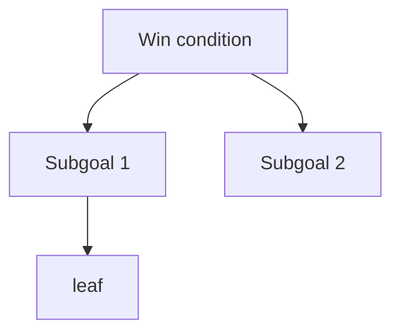

# Plan

## Win condition

<!-- One line. What has to be true for this submission to be good?
Not "finish the task" - the actual outcome the task is a proxy for.
Everything below exists to make this line true. -->

**...**

## Decomposition

<!-- Each level answers: what must be true for the parent to hold?
Leaves are concrete and checkable. Mark leaves [ ] / [x] / TBD.
Tag anything uncertain with TBD: rather than silently guessing. -->

### 1. <subgoal - one branch of the tree>

- [ ] leaf: concrete, checkable
- [ ] leaf:
- TBD: open question, and what I assumed to keep moving

### 2. <subgoal>

- [ ] leaf:
- [ ] leaf:

### 3. It does not break
<!-- Edge cases live here as leaves, not in a separate section.
Empty/null input, boundaries, duplicates, concurrency, large input. -->

- [ ] leaf:

### 4. It cannot be abused
<!-- Security as a branch: untrusted input, authz, injection, secrets,
errors that leak internals. "Not applicable because X" is a real leaf. -->

- [ ] leaf:

## Commit map

<!-- THE KEY TABLE. One commit per subgoal branch, NOT per leaf.
Target 6-10 commits total. This is the walkthrough outline: on camera
you read down this table, and each row is one thing you can explain. -->

| # | Commit | Closes |
|---|---|---|
| 1 |  | 1.1, 1.2 |
| 2 |  | 1.3 |

## Rejected alternatives

<!-- The most-asked walkthrough question. One line each. -->

- **X** - rejected because ...

## Demo script

<!-- FILL THIS IN AND VERIFY EVERY COMMAND BY ACTUALLY RUNNING IT.
Paste the real output underneath. On camera you read from here - you do
not improvise commands, and you do not debug on a one-minute timer.
Remember the walkthrough container is a FRESH checkout at ~/app: deps are
probably not installed, so note the install step even if it is slow. -->

**Where things are**

```
```

**Install (if needed)**

```
```

**Run it**

```
```
<!-- real output pasted here -->

**Prove it works** - the single command that demonstrates correctness

```
```
<!-- real output pasted here -->

**If it will not run on camera:** say what it does, show the captured
output above, and move on. Do not burn the question debugging.

## Diagram

<!-- Mirror the decomposition above. Renders on GitHub, and gives you
something to point at on camera. -->


