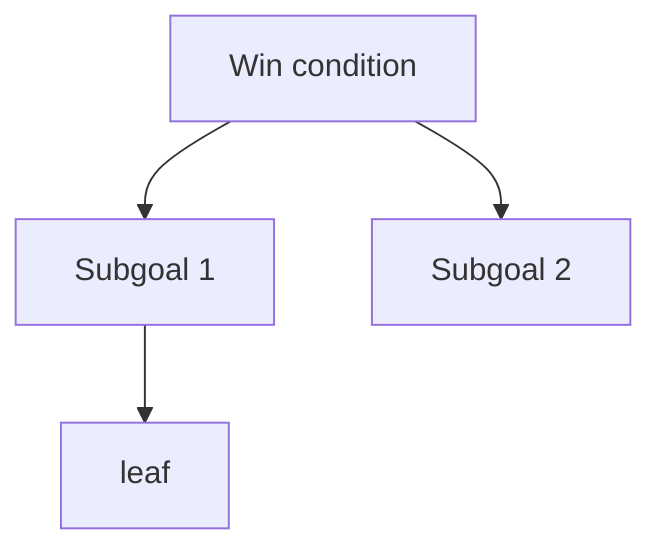

# Plan

## Win condition

<!-- One line. What has to be true for this submission to be good?
Not "finish the task" - the actual outcome the task is a proxy for.
Everything below exists to make this line true. -->

**Win the hackathon.** (his words, 2026-09-12)

## Decomposition

<!-- Each level answers: what must be true for the parent to hold?
Leaves are concrete and checkable. Mark leaves [ ] / [x] / TBD.
Tag anything uncertain with TBD: rather than silently guessing. -->

### 1. Build a project that is technically impressive

#### 1.1 A deterministic city world (seeded, pure function, reproducible)
#### 1.2 Mayors that differ only in how they close the loop (same model, same seed; human is the fifth)
#### 1.3 A hidden rubric and a judge that never leaks into the mayors
#### 1.4 Proof it improves (several runs per mayor, variance shown, one visible self-catch)

### 2. Build a project that is visually appealing even for a non-technical audience

#### 2.1 A city you can watch change (tile grid; buildings rise and rot from state)
#### 2.2 A decision is felt (two clocks: decide card, term animation, score tick; cause tags; visible lag)
#### 2.3 Four cities side by side, scrubbable through time
#### 2.4 The world embodies the economy (cars vs horses, shuttered shops, crowds, sky; click a building to talk)
#### 2.5 Anyone in the room can play (human mayor, same hidden rubric, leaderboard)

### 3. Build a project that uses the sponsor platforms

### 4. It gets submitted and demoed on time

<!-- Level 1 (four nodes) agreed 2026-09-12 ~10:10. Next level proposed, not yet agreed. -->

- TBD: tickets live in PLAN.md + git for now; Linear workspace choice pending (only team is Fana AI).

## Commit map

<!-- THE KEY TABLE. One commit per subgoal branch, NOT per leaf.
Target 6-10 commits total. This is the walkthrough outline: on camera
you read down this table, and each row is one thing you can explain. -->

| # | Commit | Closes |
|---|---|---|
| 1 |  | 1.1, 1.2 |
| 2 |  | 1.3 |

## Rejected alternatives

<!-- The most-asked walkthrough question. One line each. -->

- **X** - rejected because ...

## Demo script

<!-- FILL THIS IN AND VERIFY EVERY COMMAND BY ACTUALLY RUNNING IT.
Paste the real output underneath. On camera you read from here - you do
not improvise commands, and you do not debug on a one-minute timer.
Remember the walkthrough container is a FRESH checkout at ~/app: deps are
probably not installed, so note the install step even if it is slow. -->

**Where things are**

```
```

**Install (if needed)**

```
```

**Run it**

```
```
<!-- real output pasted here -->

**Prove it works** - the single command that demonstrates correctness

```
```
<!-- real output pasted here -->

**If it will not run on camera:** say what it does, show the captured
output above, and move on. Do not burn the question debugging.

## Diagram

<!-- Mirror the decomposition above. Renders on GitHub, and gives you
something to point at on camera. -->


